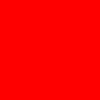
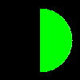
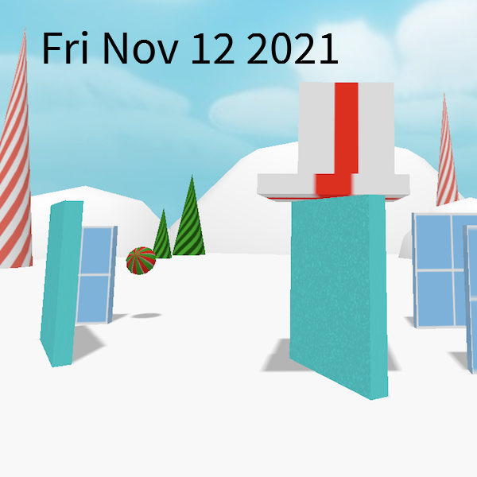

# PureImage

PureImage is a pure 100% JavaScript implementation of the HTML Canvas 2D drawing API for NodeJS.
It has no native dependencies. You can use it to resize images, draw text, render badges,
convert to grayscale, or anything else you could do with the standard Canvas 2D API. It also has
additional APIs to save an image as PNG and JPEG.

# Typescript Rewrite

As of version 0.4.\* PureImage has been rewritten in 100% Typescript. The module is compiled
to both Common JS and ES Modules. If it was working for you before it should still work, but
if you notice anything off please file a bug report.

Also _note_ that `font.load()` now returns a promise instead of using a callback. If you
need synchronous support you can still fuse `font.loadSync()`.

# Installation

```bash
npm install pureimage
```

# Simple example

Make a 100x100 image, fill with red, write to png file

```javascript
import * as PImage from "pureimage";
import * as fs from "fs";

// make image
const img1 = PImage.make(100, 100);

// get canvas context
const ctx = img1.getContext("2d");

// fill with red
ctx.fillStyle = "red";
ctx.fillRect(0, 0, 100, 100);

//write to 'out.png'
PImage.encodePNGToStream(img1, fs.createWriteStream("out.png"))
  .then(() => {
    console.log("wrote out the png file to out.png");
  })
  .catch((e) => {
    console.log("there was an error writing");
  });
```

result



## supported Canvas Features

_note_: PureImage values portability and simplicity of implementation over speed. If you need
maximum performance you should use a different library backed by native code, such as [Node-Canvas](https://www.npmjs.com/package/canvas)

- set pixels
- stroke and fill paths (rectangles, lines, quadratic curves, bezier curves, arcs/circles)
- copy and scale images (nearest neighbor)
- import and export JPG and PNG from streams using promises
- render basic text (no bold or italics yet)
- anti-aliased strokes and fills
- transforms
- standard globalAlpha and rgba() alpha compositing
- clip shapes

# On the roadmap, but still missing

- gradients fills
- image fills
- blend modes besides SRC OVER
- smooth clip shapes
- bold/italic fonts
- smooth image interpolation

# Why?

There are more than enough drawing APIs out there. Why do we need another? My
personal hatred of C/C++ compilers is [widely known](https://joshondesign.com/2014/09/17/rustlang).
The popular Node module [Canvas.js](https://github.com/Automattic/node-canvas) does a great
job, but it's backed by Cairo, a C/C++ layer. I hate having native dependencies
in Node modules. They often don't compile, or break after a system update. They
often don't support non-X86 architectures (like the Raspberry Pi). You have
to have a compiler already installed to use them, along with any other native
dependencies pre-installed (like Cairo).

So, I made PureImage. Its goal is to implement the HTML Canvas spec in a headless
Node buffer. No browser or window required.

PureImage is meant to be a small and maintainable Canvas library.
It is _not meant to be fast_. If there are two choices of algorithm we will
take the one with the simplest implementation, and preferably the fewest lines.
We avoid special cases and optimizations to keep the code simple and maintainable.
It should run everywhere and be always produce the same output. But it will not be
fast. If you need speed go use something else.

PureImage uses only pure JS dependencies. [OpenType](https://github.com/nodebox/opentype.js/)
for font parsing, [PngJS](https://github.com/niegowski/node-pngjs) for PNG import/export,
and [jpeg-js](https://github.com/eugeneware/jpeg-js) for JPG import/export.

# Examples

Make a new empty image, 100px by 50px. Automatically filled with 100% opaque black.

```js
var PImage = require("pureimage");
var img1 = PImage.make(100, 50);
```

Fill with a red rectangle with 50% opacity

```js
var ctx = img1.getContext("2d");
ctx.fillStyle = "rgba(255,0,0, 0.5)";
ctx.fillRect(0, 0, 100, 100);
```

Fill a green circle with a radius of 40 pixels in the middle of a 100px square black image.

```js
var img = PImage.make(100, 100);
var ctx = img.getContext("2d");
ctx.fillStyle = "#00ff00";
ctx.beginPath();
ctx.arc(50, 50, 40, 0, Math.PI * 2, true); // Outer circle
ctx.closePath();
ctx.fill();
```



Draw the string 'ABC' in white in the font 'Source Sans Pro', loaded from disk, at a size
of 48 points.

```js
test("font test", (t) => {
  var fnt = PImage.registerFont(
    "test/fonts/SourceSansPro-Regular.ttf",
    "Source Sans Pro",
  );
  fnt.loadSync();
  var img = PImage.make(200, 200);
  var ctx = img.getContext("2d");
  ctx.fillStyle = "#ffffff";
  ctx.font = "48pt 'Source Sans Pro'";
  ctx.fillText("ABC", 80, 80);
});
```

Write out to a PNG file

```js
PImage.encodePNGToStream(img1, fs.createWriteStream("out.png"))
  .then(() => {
    console.log("wrote out the png file to out.png");
  })
  .catch((e) => {
    console.log("there was an error writing");
  });
```

Read a jpeg, resize it, then save it out

```js
PImage.decodeJPEGFromStream(fs.createReadStream("test/images/bird.jpg")).then(
  (img) => {
    console.log("size is", img.width, img.height);
    var img2 = PImage.make(50, 50);
    var c = img2.getContext("2d");
    c.drawImage(
      img,
      0,
      0,
      img.width,
      img.height, // source dimensions
      0,
      0,
      50,
      50, // destination dimensions
    );
    var pth = path.join(BUILD_DIR, "resized_bird.jpg");
    PImage.encodeJPEGToStream(img2, fs.createWriteStream(pth), 50).then(() => {
      console.log("done writing");
    });
  },
);
```

This examples streams an image from a URL to a memory buffer, draws the current date in big black letters, and writes the final image to disk

```javascript
import * as PImage from "pureimage";
import fs from "fs";
import * as client from "https";
let url =
  "https://vr.josh.earth/webxr-experiments/physics/jinglesmash.thumbnail.png";
let filepath = "output_stream_sync.png";
//register font
const font = PImage.registerFont(
  "../test/unit/fixtures/fonts/SourceSansPro-Regular.ttf",
  "MyFont",
);
//load font
font.loadSync();
//get image
client.get(url, (image_stream) => {
  //decode image
  PImage.decodePNGFromStream(image_stream).then((img) => {
    //get context
    const ctx = img.getContext("2d");
    ctx.fillStyle = "#000000";
    ctx.font = "60pt MyFont";
    ctx.fillText(new Date().toDateString(), 50, 80);
    PImage.encodePNGToStream(img, fs.createWriteStream(filepath)).then(() => {
      console.log("done writing to ", filepath);
    });
  });
});
```

produces



The same as above but with Promises

```javascript
import * as PImage from "pureimage";
import fs from "fs";
import * as client from "https";

let url =
  "https://vr.josh.earth/webxr-experiments/physics/jinglesmash.thumbnail.png";
let filepath = "output.png";
let fontpath = "test/unit/fixtures/fonts/SourceSansPro-Regular.ttf";
PImage.registerFont(fontpath, "MyFont")
  .loadPromise()
  //Promise hack because https module doesn't support promises natively)
  .then(() => new Promise((res) => client.get(url, res)))
  .then((stream) => PImage.decodePNGFromStream(stream))
  .then((img) => {
    //get context
    const ctx = img.getContext("2d");
    ctx.fillStyle = "#000000";
    ctx.font = "60pt MyFont";
    ctx.fillText(new Date().toDateString(), 50, 80);
    return PImage.encodePNGToStream(img, fs.createWriteStream(filepath));
  })
  .then(() => {
    console.log("done writing", filepath);
  });
```

The same as above but with async await

```javascript
import fs from "fs";
import * as https from "https";
const https_get_P = (url) => new Promise((res) => https.get(url, res));

async function doit() {
  let url =
    "https://vr.josh.earth/webxr-experiments/physics/jinglesmash.thumbnail.png";
  let filepath = "output_stream_async.png";
  //register font
  const font = PImage.registerFont(
    "../test/unit/fixtures/fonts/SourceSansPro-Regular.ttf",
    "MyFont",
  );
  //load font
  await font.load();
  //get image
  let image_stream = await https_get_P(url);
  //decode image
  let img = await PImage.decodePNGFromStream(image_stream);
  //get context
  const ctx = img.getContext("2d");
  ctx.fillStyle = "#000000";
  ctx.font = "60pt MyFont";
  ctx.fillText(new Date().toDateString(), 50, 80);
  await PImage.encodePNGToStream(img, fs.createWriteStream(filepath));
  console.log("done writing to ", filepath);
}
doit()
  .then(() => console.log("done"))
  .catch((e) => console.error(e));
```

Save a canvas to a NodeJS buffer as PNG using a `PassThrough` stream:

```javascript
import * as PImage from "pureimage";
import { PassThrough } from "stream";
const passThroughStream = new PassThrough();
const pngData = [];
passThroughStream.on("data", (chunk) => pngData.push(chunk));
passThroughStream.on("end", () => {});
pureimage.encodePNGToStream(canvas, passThroughStream).then(() => {
  let buf = Buffer.concat(pngData);
  expect(buf[0]).to.eq(0x89);
  expect(buf[1]).to.eq(0x50);
  expect(buf[2]).to.eq(0x4e);
  expect(buf[3]).to.eq(0x47);
  done();
});
```

# Troubleshooting

### missing or broken text

PureImage uses [OpenType.js](https://opentype.js.org) to parse fonts
and rasterize glyphs. If you are having trouble rendering something first
check on the [OpenType website](https://opentype.js.org) that the font can
actually be parsed and rendered. If you are rendering non-latin character sets
you may need to install an additional dependency to your operating system.
For example, rendering arabic text may require `pip install arabic-reshaper` on Linux.

### Using a really large image buffer

PureImage has no inherit size limitations, but NodeJS does have a default max memory
setting. You can learn how to increase the default [here](https://stackoverflow.com/questions/34356012/how-to-increase-nodejs-default-memory)

# New 0.4.x release

After another long lull, I've ported PureImage to Typescript. Most of the work
was actually done by the amazing and talented [Josh Hemphill](https://github.com/josh-hemphill).
As part of this port I switched to using [esbuild](https://esbuild.github.io) for compiling
& packaging the Typescript, and [Vitest](https://vitest.dev) for unit tests.
They are vastly faster than our old system.

This release also fixes tons of bugs and adds some small features:

- updated PngJS, OpenType.jS and JPegJS to their latest version.
- Node 14 is now the minimum supported version
- linear and radial gradient fills are supported. See [test/gradientfill.test.ts](test/gradientfill.test.ts))

# New 0.3.x release

After a long lull, I've ported the code to modern ES6 modules, so you can just do an
`import pureimage from 'pureimage'` like any other proper modern module. If you are using
`require('pureimage')` it should just work thanks to the `dist/pureimage-umd.cjs` file built
with [Rollup](https://rollupjs.org). It also has a stub to let `pureimage` run in the browser and delegate to the
real HTML canvas. This helps with isomorphic apps.

Other updates include

- Switch to [MochaJS](https://mochajs.org) for the unit tests.
- add more unit tests.
- [support](https://github.com/joshmarinacci/node-pureimage/issues/117) drawing images when using transforms
- [implement](https://github.com/joshmarinacci/node-pureimage/issues/100) `rect()`
- implement ImageData with `getImageData()` and `putImageData()`
- fix gradient fill
- [add all](https://github.com/joshmarinacci/node-pureimage/commit/ba975575ca986ea11c427082d88833fb153e779d) CSS named colors
- [support](https://github.com/joshmarinacci/node-pureimage/pull/108) #rgb, #rgba, and #rrggbbaa color strings
- applied more bug fixes from PRs, thanks to our contributors.

# New 0.1.x release

I've completely refactored the code so that it should be easier to
maintain and implement new features. For the most part there are no API changes (since the API is
defined by the HTML Canvas spec), but if you
were using the font or image loading extensions
you will need to use the new function names and switch to promises. For more information, please see [the API docs](http://joshmarinacci.github.io/node-pureimage)

I'm also using Node buffers instead of arrays internally, so you can work with large images
faster than before. Rich text is no longer supported, which is fine because it never really worked
anyway. We'll have to find a different way to do it.

I've tried to maintain all of the patches that have been sent in, but if you contributed a patch
please check that it still works. Thank you all! - josh

# Thanks!

Thanks to Nodebox / EMRG for [opentype.js](https://github.com/nodebox/opentype.js/)

Thanks to Rosetta Code for [Bresenham's in JS](http://rosettacode.org/wiki/Bitmap/Bresenham%27s_line_algorithm#JavaScript)

Thanks to Kuba Niegowski for [PngJS](https://github.com/niegowski/node-pngjs)

Thanks to Eugene Ware for [jpeg-js](https://github.com/eugeneware/jpeg-js)

Thanks for patches from:

- Dan [danielbarela](https://github.com/danielbarela)
- Eugene Kulabuhov [ekulabuhov](https://github.com/ekulabuhov)
- Lethexa [lethexa](https://github.com/lethexa)
- The Louie [the-louie](https://github.com/the-louie)
- Jan Marsch [kekscom](https://github.com/kekscom)
